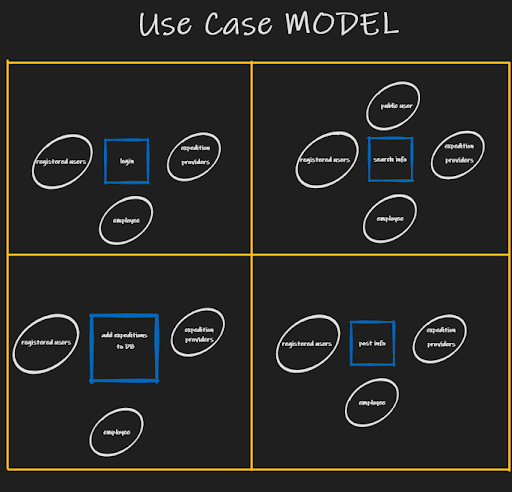
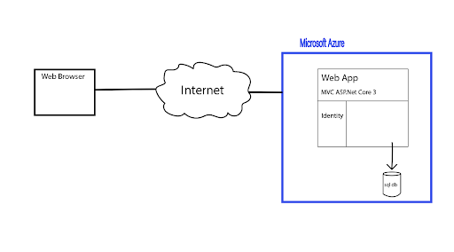
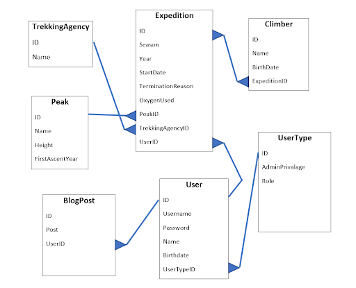

Milestone 2

## List of Stakeholders and their Positions - 
        The Himalayan Database - Owns created website and database
        Employees - Administer site and moderate social hub content (Ensure trusted information on the site)
        End Users
                * Climbers - Find trusted information, post about expeditions
                * The Public - Find information, and statistics for school projects
                * Expedition Providers - Post about expeditions
                * Trekking Agencies - Confirm climbs, find climbers, post about future expeditions

## Elicitation -
        1. Is the goal or outcome well defined? Does it make sense? 
                Yes - Because under the assumption that the website is already established, but requires our help to add features and make it in the eyes of the owner and stakeholders. 
        2. What is not clear from the given description? 
                What role does the employee play, do they all have administrative privileges? And can anyone add climb information to the database, does it need to be approved by an employee or can only certain users add expedition information? Do expedition providers lead the expeditions themselves? 
        3. How about scope? Is it clear what is included and what isn't? 
                The needs and features of the website are clear on what needs to be added and available to users. What is not clear is what is etc in most parts and what is “and lots more!”
        4. What do you not understand? 
                *Technical domain knowledge - Stated above in Q2 and Q3 
                * Business domain knowledge - Will this be sold to anyone and are all features free or is there a paid version of the site. 
        5. Is there something missing? 
                At the moment nothing appears to be missing, we have enough information to go with and in future meetings specifics can be asked as we reach milestones. 

## List of Needs and Features -
        1. search bar for expeditions, climbers, dates, mountains, heights, etc.
        2. Search Filter: Be able to refine search by year, climb status or other attributes
        3. yearly info in relation to request #2
        4. Expedition Provider Account
                * Request form / Contact us Page
        5. Employee account
                *  Admin privileges
                * Create, Read, Update access to db
        6. Nav bar
        7.Expedition tips/Weather tip/”Did you know?" or quick facts (Dynamic Info)
        8. A Social Hub: A climber club or review (Moderated by HD employees)
                * Blog post
                * Updates on certain treks
                * User provided data

## Analysis -

        1. For each attribute, term, entity, relationship, activity ... precisely determine its bounds, limitations, types and constraints in both form and function. Write them down. 

                Search Bar:
                        Bounds:Can read data from the database and send user to a results view
                        Limitations: Cannot update, delete or create entry into the database, cannot sort filter results.
                        Types: Textbox, key words 
                        Constraints: No numbers, or special characters?

                Search Filter:
                        Bounds:Can send query strings to the search filter controller.
                        Limitations: Cannot update, delete or create entry into the database must use hardset input elements to indicate sorting criteria.
                        Types: radio buttons, select box, datetime input element
                        Constraints: no keywords or text entries.

                Expedition Provider Account:
                        Bounds: Can access submission form view to create an expedition in the expedition database table. Can send request forms to employees. 
                        Limitations: no direct update or delete privileges on the expedition table.
                        Types: add ASP.NET Identity and implement Role based Authorization for Expedition provider 
                        Constraints:Expedition providers can only create records in the expedition table on the submission form view.

                Employee Account:
                        Bounds: Full crud access to database tables and request forms. 
                        Limitations:  update or delete expeditions via request form from Expedition provider.
                        Types: add ASP.NET Identity and implement Role based Authorization for employee 
                        Constraints: admin/employee have full crud privileges to the entire site, expedition provider can update the database via forms and submissions. Users have update/delete privileges in the social hub database table.

                Nav Bar:
                        Bounds: Links to 3 views, sign in page, front page and social hub, contains search bar
                        Limitations: 
                        Types:3 anchor links that lead to the selected view page. Search bar text input box and search button element.
                        Constraints: restricted to only main pages

                Expedition tips:
                        Bounds: posts from all user accounts
                        Limitations: Tips can only take in a certain character amount
                        Types: blog, textarea
                        Constraints: must be a user to post, no profanity, 

                Social Hub:
                        Bounds: contains post entries submitted by registered users. Employee roles granted full crud access to the social hub database table.
                        Limitations: public users have read only access, registered users have full crud access only to their own posts in the  social hub posts database table. registered users have read access to all other posts.
                        Types:textarea 
                        Constraints:alphanumerical, special characters, no images, gifs or files larger than 5mbs.

        2. Do they work together or are there some conflicting requirements, specifications or behaviors? 

                Yes the features work together no conflicting requirements or specifications were found. Employees have full crud access to db while other roles have limited access.

        3. Have you discovered if something is missing?
                No other missing information found.

## Diagrams -

[UML Diagram](https://github.com/NickApa/NATRSS/blob/dev/Milestone2/UMLDiagram_Milestone_2.png)  

[Architecture Drawing](https://github.com/NickApa/NATRSS/blob/dev/Milestone2/ArchitectureDiagram_Milestone_2.png)  

[DB/ER Diagram](https://github.com/NickApa/NATRSS/blob/dev/Milestone2/BR_ERDiagram_milestone_2.png)  

## Identify Non-Functional Requirements -

        1. English is the default language, but we must support visitors and data in other character sets 
        2. Distances and measurements in US / Metric systems
        3. Color Blind option for easier use of the site

## Identify Functional Requirements (In User Story Format) - 
        E - Being able to login to the site as a certain type of user
                U - As an employee I would like to be able to login and have administrative privileges so that i can update the database and answer request forms. 
                * T - Copy SQL schema \from an existing ASP.NET Identity database and integrate it into our UP, DOWN scripts
                * T - Configure web app to use our db with Identity tables in it
                * T - Create an employee role table to administer site features
                * T - Re-enable login/register links 
                * T - Manually test register and login; user should easily be able to see that they are logged in
                U - As a user I would like to be able to login to an account to look up information and edit/post information about climbs.
                * T - Copy SQL schema from an existing ASP.NET Identity database and integrate it into our UP, DOWN scripts
                * T - Configure web app to use our db with Identity tables in it
                * T - Create a user table that allows them to view data and to post to Climber Hub
                * T - Re-enable login/register links 
                * T - Manually test register and login; user should easily be able to see that they are logged in

        E - Search Function
                U - As a public user I would like to be able to browse or search for expeditions, climbers,     dates, mountains, heights, etc. so that I can easily find them. 
                        * T - At the top of the home page create a div with a textbox to serve as a search bar.
                        * T - Create a search controller that linqs to the database
                        * T - Create a view for search results.
                U - As a public user I would like to be able to refine my search results so that I can sort or retrieve data based on year or other attributes.b
                        * T -  On the search-results view, create a div with a date input element, as well as input elements for all of the other attributes. 
                        * T - Create a refine-search controller that returns data based on filter selections
                U - As a public user I would like to find information/tips about the expedition I searched for so that I can have more tailored details about each expedition.
                        * T - create a view that displays all data from a selected expedition including tips and information from the expedition provider.

        E - Social Hub
                U - As a user I would like to be able to post my experiences and tips with fellow trekkers so that I can interact with other users on the site.
                        * T - Create a view and controller for the social hub
                        * T - Restrict posting privileges to registered users of the site. 
                        * T - Create a form for entering posts on the social hub
                        * T - create a social hub post table in the database

                U - As an employee I would like to monitor the user-provided content so that I can, in terms of security, provide a safe online environment that complies with the social hub rules.
                        * T - In home controller create crud model for social hub content and expeditions.
                        * T - Ensure that employees can edit, read, delete and create posts on Climber hub and on expeditions pages.

        U - As a visitor to the site I would like to see a fantastic and modern homepage so that I can be introduced to the site and the features currently available.
                * T -  Create starter ASP dot NET Core MVC Web Application with Individual User   Accounts and no unit test project
                * T - Choose CSS library (Bootstrap 4, or ?) and use it for all pages
                * T - Create nice bare homepage: write initial welcome content, customize navbar, hide links to login/register
                * T -  Create SQL Server database on Azure and configure a web app to use it. Hide credentials.
                * T - Deploy it on Azure

        U - As a public user I would like to be able to see quick statistics(dynamic information) about expeditions, mountains, and other facts so that I can stay informed. 
                * T - Create html file for statistics, style with CSS
                * T - Link page with the nav bar at the top in the layout file
                * T - Using Controller get info from database
                * T - Create a view in the controller that outputs facts on peak height, average height, number of peaks, number of climbs in the last 10 years 

        U - As an expedition provider I would like to enter information about an expedition.
                * T - Create an html form to enter data about an expedition
                * T - link this form to the expeditions page
                * T - use databinding to access entered information on the controller
                * T - save the expedition to the database from within the controller
                * T - redirect to a page with a “submission completed, returning to expeditions”
                * T - redirect to expeditions page showing the entered expedition 

        U - As an expedition provider I would like to submit a request to the site employees to update or remove an existing expedition I entered.\
                * T - Create a button for requesting modification to an expedition.
                * T - Link to an html form to get information on what needs to be done
                * T - redirect to a page with a “thank you for contacting us, we will review your request to modify an expedition”
                * T - redirect to home page

## Timeline - 
        * Milestones every Monday starting 1/18/21
        * Sprints every two weeks on Mondays starting 2/1/21
        * Features added to site bi-weekly until finished
        * Final release Mid March 2021

## Vision Statement - 
        Providing a trusted resource about expeditions on the Himalayas for students, climbers, expedition providers and anyone who is interested in the subject. To further those users knowledge, curiosity and interest in regards to the Himalayan mountain range. Following the MVC approach using C#, HTML, SQL Server, Javascript, and CSS. The cost will be between $15,000-$30,000 funded by the site owner. New features will be added every other week starting February 1st. The process being followed will be D.A.D. Team members include Nick Apa, Armani Tufaga, Tyler Bartlett and Reggie Johnson of team NATR. The team will meet with stakeholders on a weekly basis.