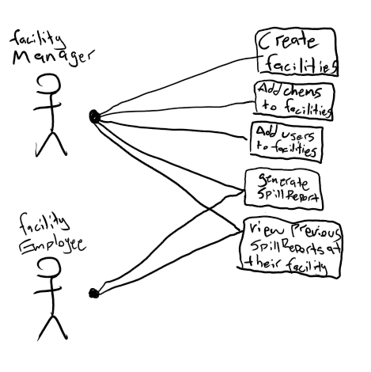
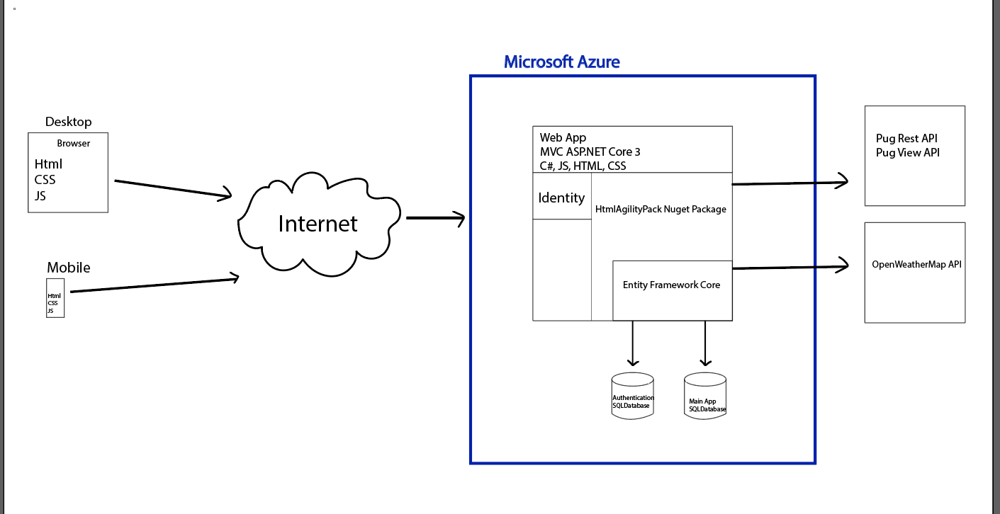
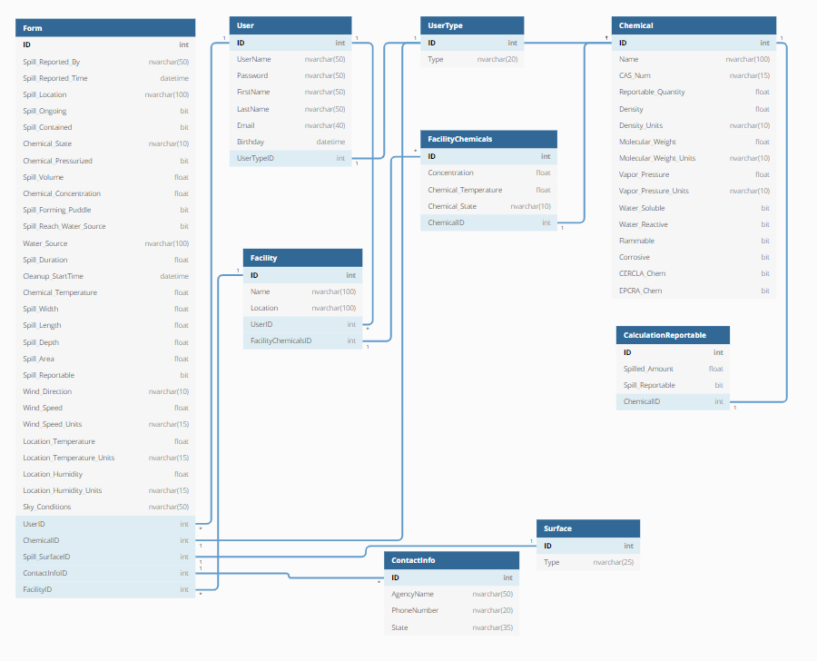

Spill Tracker

## List of Stakeholders and their Positions - 
- Facilities that use chemicals above the threshold planning quantity
- Employees of these facilities
- State and Federal Environmental Agencies
- Chemical Manufacturers and Transportation company

## Elicitation -
1. Is the goal or outcome well defined? Does it make sense? 
Yes, because we need to create a web app that will help people who need to report chemical spills. There was also enough provided forms and information to understand what needs to be completed.

2. What is not clear from the given description?
Nothing at this time is unclear, more clarity might be needed in the future in regards to all that will be in the database, but at this time we think we have it all covered. Federal to statewide regulations are not fully clear and will require more research and information.   

3. How about scope? Is it clear what is included and what isn't? 
For scope everything is pretty clear, a user inputs a form or calculates if a spill is reportable, based on the results they will get contact information on next steps. 

4. What do you not understand? 
* Technical domain knowledge - HTMLAgilityPack, scrubbing online for needed information. Identity and authorization for users and logins. 
* Business domain knowledge - State and Federal requirements involving extremely hazardous substances, reporting requirements

5. Is there something missing? 
 Chemical information is missing but will be gathered in the early stages of the project. 

## Needs and Features (Needs first) - 

- User login
    - Store company or location
    - Store chemicals that are frequently used
    - Store past spills

- Spill form
    - Allows users to input:
    - chemical info
    - Location of spill
    - Weather or external factors
    - See example report form

- Spill Calculation
    - Calculates all variables
    - Informs user if amount is reportable

- Report information
    - How to report
    - Who to contact/notify

- Scrubbing of chemical information
    - Use HTMLAgilityPack to get info from website
    - Populating chemical database

- Federal / State Requirements
    - Specific reporting info for each state/nationwide
    - Contact information for each state on who to report to

- Have weather information available
    - Use Open Weather Maps Api for data

- Have the ability for user to export data entered
    - Export data through XML or PDF format

- Admin feature for a company to have other users tie in to their specific company and see/access their information
    - one user to manager other users for a facility or facilities

- Geocoordinates and location identifier to determine where a spill may have taken place
	- Use a maps API to locate coordinates
	- Store that location in the database

## Analysis -
1. For each attribute, term, entity, relationship, activity ... precisely determine its bounds, limitations, types and constraints in both form and function. Write them down. 

- Form - 
	- Bounds: Takes user input, adds to db, displays if reportable, and can be exported
	- Limitations: Many inputs, mistakes can be made easily
	- Types: Text, Checkbox, Date times, drop downs, numbers
	- Constraints: Input lengths

- Report Calculator - 
	- Bounds: Takes user input on chemical, amount spilled and returns if reportable
	- Limitations: cannot be exported to form, works for one chemical at a time
	- Types: Dropdowns, numbers, text
	- Constraints: input length, no nulls

- Employee Account -
	- Bounds: Can fill out forms and calculate spills
	- Limitations: Cannot monitor other employees at facility, can only see forms filled out at their own company
	- Types: Identity and authorization
	- Constraints: 

- Employer Account - 
	- Bounds:  Can add new facilities to their list of facilities, can create the list of chemicals at those facilities, can add users to one or more of those facilities, can fill out forms and calculate spills for any of those facilities.
	- Limitations: can only see forms filled out at their facilities, cannot monitor users/forms of different companies 
	- Types: Identity and authorization
	- Constraints:
 
- Facility - 
	- Bounds: Can report the number of chemicals they provide
	- Limitations: Cannot exceed  a certain amount of chemicals
	- Types: forms, textbox, numbers
	- Constraints: 

- Facility Chemicals -
	- Bounds: List of chemicals at a specific facility
	- Limitations: Cannot add new chemicals to the master chemical list
    - Types: Chemicals, numbers, text
    - Constraints: no chemical not in master list

- Surfaces - 
	- Bounds: Types of surfaces chemicals can be spilled on
	- Limitations: Must be in surface master list
	- Types: Text
	- Constraints: no numbers, no surface not in master list

2. Do they work together or are there some conflicting requirements, specifications or behaviors? 

- They will all work together bringing in helpful and useful information to forms, facilities and if the spill is reportable. The only things that sort of conflict is the reportable calculator and the form. Both can bring a user to the same ends but depends if a form has already been filled out. 

3. Have you discovered if something is missing?

- At this time nothing appears to be missing. 

## Diagrams - 

[UML Diagram](https://github.com/NickApa/NATRSS/blob/dev/Milestone4/UML%20Diagram.png)  

[Architecture Drawing](https://github.com/NickApa/NATRSS/blob/dev/Milestone4/ArchitectureDrawing.png)  

[DB/ER Diagram](https://github.com/NickApa/NATRSS/blob/dev/Milestone4/SpillTrackerDbDiagram.png)  

## Identify Non-Functional Requirements -
    1. WAI-ARIA Support
    2. Distances and measurements in US / Metric systems
    3. Color Blind option for easier use of the site

## Identify Functional Requirements (In User Story Format) - 
    E - User Management
    E - Build Site Database
        U - As a user I would like to be able look up chemical information and see a list of all available chemicals.
	    * T- Scrubbing of chemical information from CERCLA/EPCRA
	    * T- Get Chemical Identification data from Pug Rest API
	    * T- Get Extra Chemical Data from the Pug View API
        U - As a user I would like to be able to manage my facility(ies) 
	    * T -
	    * T -
	    * T -
        U - As a user I would like to be able to save all the   chemicals used in my facility for future use
        * T-
        * T-
	    * T-
        U - As a user I would like to be able to see past spills at my facility
	    * T -
	    * T -
	    * T - 
    E - Spill Form
    E - Spill Calculations
    E - Design User Interface
    E - Report Information
    E - Export data through XML or PDF format
    E - Geo Coordinates and location identifier 

## Timeline - 
Milestones every Monday starting 1/18/21
Sprints every two weeks on Mondays starting 2/15/21
Features added to site bi-weekly until finished
Final release mid June 2021

## Vision Statement - 
For environmental workers who need to report spills or look up information about chemicals if a report is needed. The Chemical Spill Tracker is an information system that will allow people to calculate whether or not the spill at the company or location will need to be reported to the proper authorities. This site will allow users to save and store the chemical information at their company or site for future use. They will also be able to access the weather information where the spill occurred to help with the calculation. After the spill has been calculated it will inform the user if they need to make a call or if the spill is still within the federal amount that is okay to not report. If a spill needs to be reported, then the site will provide the user with the proper information on how to report it and who to notify. Unlike the current spill reporting method, our product will allow users to enter all needed information, get the calculation automatically and show if it is reportable all in one location without having to look up chemicals, do the calculation manually and then search for the proper authorities to report to. 

